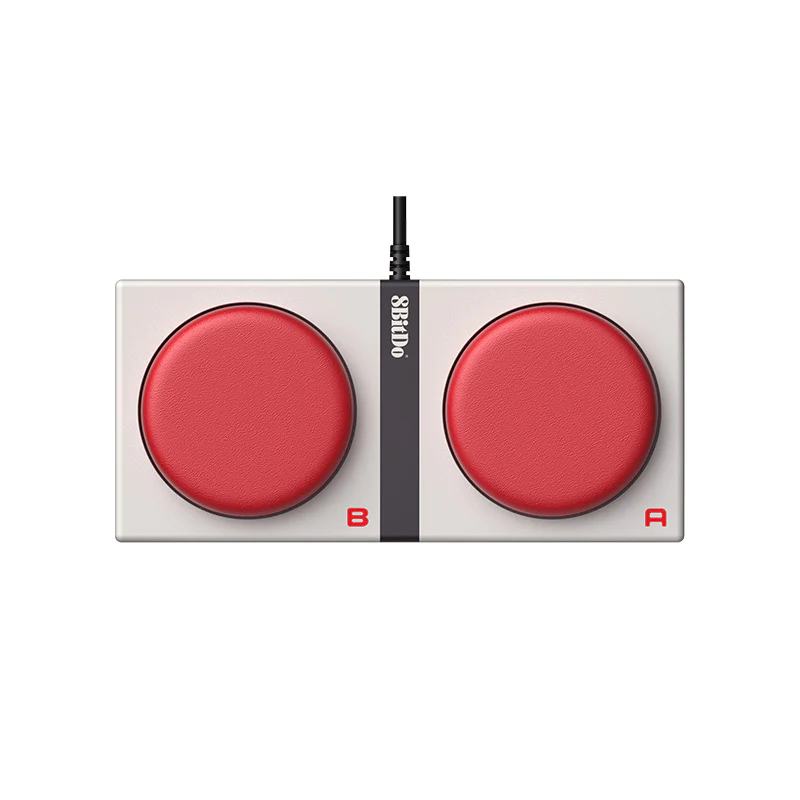

# Hardware buttons for stock trading



Repurpose [8BitDo Super Buttons](https://shop.8bitdo.com/products/8bitdo-dual-super-buttons) for stock market trading.

## Hardware

The buttons are connected to a Raspberry Pi Pico via 3.5mm jack.  
It runs Circuit Python to emulate a HID keyboard device.  
The code polls GPIO and sends Ctrl+A and Ctrl+B keystrokes accordingly.

### Setup

1. Follow guide to
   install [CircuitPython](https://learn.adafruit.com/getting-started-with-raspberry-pi-pico-circuitpython/circuitpython)
   on Raspberry Pi.
2. `code.py` file needs to be copied to CircuitPython mass storage device.
3. Solder a [3.5mm jack](https://www.digikey.com/en/products/detail/cliff-electronic-components-ltd/FC68133/21264758) to
   pins 12, 15 and GND. (doesn't matter as long as you update `code.py`)

## Software

No special software is needed, you just need to bind Ctrl+A & Ctrl+B on your target trading app.  
On Ubuntu, apps usually listen to keystrokes only when the window is in focus.  
This can be a safety feature: simply put the trading software window out of focus and there's no chance of the thing
going rouge on you.

### Exclusive app control

I like to use TradingView for looking at the chart while trading in WeBull.
I would hate to have pressed the buy button only to find out WeBull was not in focus. So I wrote an X11 script that will grab exclusive access to the HID keyboard and forward the keystrokes to a specific
window (e.g. WeBull). This means I can send buy/sell orders even if WeBull is minimized.

### prerequisites

```
sudo apt-get install libevdev2 libevdev-dev
sudo apt-get install libx11-dev
sudo apt-get install libxtst-dev
sudo apt-get install cmake
```

### build

```
mkdir build
cd build
cmake ..
make
```

### usage

```
./install-udev.sh # run once to give read permissions to HID device  
./stock_buttons WebullDesktop
```

`WebullDesktop` here is the name of target app you want the keys to be forwarded to. (it's passed to pgrep to get pid)  
If app is not isRunning then the script will exit.

# WARNING

```
I'm not responsible if there is a bug or hw failure and it starts sending infinite "buy" keystrokes.
Maybe it is best not to leave the trading software open while away from keyboard.
In the future I might build a hardware safety switch.
You have been warned!
```
